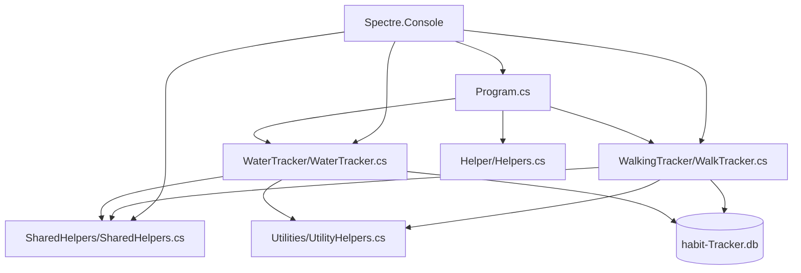

# 🏃‍♂️ HabitLogger - Personal Health Tracker

[](https://docs.microsoft.com/en-us/dotnet/csharp/)
[](https://dotnet.microsoft.com/)
[](https://www.sqlite.org/)
[](https://spectreconsole.net/)

> A sleek, interactive console application for tracking daily health habits
> including water intake and walking activities. Built with modern C# practices
> and rich terminal UI.

## 📖 Table of Contents

- [🌟 Overview](#-overview)
- [✨ Features](#-features)
- [🛠️ Tech Stack](#️-tech-stack)
- [📦 NuGet Packages](#-nuget-packages)
- [🏗️ Project Structure](#️-project-structure)
- [🎯 SOLID Principles Implementation](#-solid-principles-implementation)
- [📁 Class Architecture](#-class-architecture)
- [🚀 Getting Started](#-getting-started)
- [📊 Usage Examples](#-usage-examples)
- [🎓 Skills Demonstrated](#-skills-demonstrated)
- [🤝 Contributing](#-contributing)
- [📄 License](#-license)

## 🌟 Overview

HabitLogger is a comprehensive personal health tracking application that
empowers users to monitor and visualize their daily wellness habits. With an
intuitive console interface powered by rich terminal graphics, users can
effortlessly track water consumption and walking activities while gaining
insights through detailed statistics and progress visualization. <br>


### 🎯 Key Objectives

- **Track Daily Habits**: Monitor water intake and walking activities
- **Visual Progress**: Rich progress bars, charts, and statistical displays
- **Goal Achievement**: Set and track daily health goals
- **Data Persistence**: Reliable SQLite database storage
- **User Experience**: Intuitive navigation with beautiful console UI

**SQLite Database Storage**: 

## ✨ Features

### 💧 Water Intake Tracking

- ✅ **Add Water Records**: Log daily water consumption with timestamps
- ✅ **View Records**: Beautiful tabular display of historical data
- ✅ **Update Records**: Edit existing entries with validation
- ✅ **Delete Records**: Remove incorrect or outdated entries
- ✅ **Progress Visualization**: Real-time progress bars and goal tracking
- ✅ **Daily Goals**: 8 glasses daily target with achievement indicators
- ✅ **Statistics Dashboard**: Comprehensive consumption analytics<br>
  
  

### 🚶‍♂️ Walking Activity Tracking

- ✅ **Flexible Input**: Track by steps, distance (KM), or both
- ✅ **CRUD Operations**: Complete create, read, update, delete functionality
- ✅ **Auto Calculations**: Automatic conversion between steps and distance
- ✅ **Goal Monitoring**: 10,000 steps daily target tracking
- ✅ **Performance Metrics**: Calories burned and walking time estimates
- ✅ **Weekly Charts**: Visual progress representation <br>
  
  

### 📊 Advanced Analytics

- ✅ **Combined Statistics**: Unified health dashboard
- ✅ **Weekly Progress Charts**: 7-day trend visualization
- ✅ **Goal Achievement Tracking**: Success rate monitoring
- ✅ **Best Performance Days**: Personal record highlighting
- ✅ **Health Insights**: Intelligent progress analysis <br>
  

### 🔧 Technical Features

- ✅ **Robust Exception Handling**: Comprehensive error management
- ✅ **Input Validation**: Data integrity and user-friendly validation
- ✅ **Rich UI Components**: Tables, panels, progress bars, and charts
- ✅ **Database Reliability**: SQLite with parameterized queries
- ✅ **Responsive Console Design**: Adaptive console interface but more better
  user experience on Unix interfaces.

**Roust data Validation:** 

## 🛠️ Tech Stack

| Technology                   | Version | Purpose                   |
| ---------------------------- | ------- | ------------------------- |
| **C#**                       | Latest  | Core programming language |
| **📦 .NET**                  | 9.0     | Runtime framework         |
| **🗄️ SQLite**                | Latest  | Local database storage    |
| **🎨 Spectre.Console**       | 0.49.1  | Rich console UI framework |
| **🔧 Microsoft.Data.Sqlite** | 9.0.0   | Database connectivity     |

## 📦 NuGet Packages

### Core Dependencies

```xml
<PackageReference Include="Microsoft.Data.Sqlite" Version="9.0.0" />
<PackageReference Include="Spectre.Console" Version="0.49.1" />
```

#### 🔍 Package Details

| Package                   | Purpose             | Key Features                                                                                                   |
| ------------------------- | ------------------- | -------------------------------------------------------------------------------------------------------------- |
| **Microsoft.Data.Sqlite** | Database Operations | • Lightweight SQLite provider<br>• Parameterized queries<br>• Connection pooling<br>• Cross-platform support   |
| **Spectre.Console**       | Rich UI Framework   | • Interactive prompts<br>• Tables and charts<br>• Progress bars<br>• Styled text markup<br>• Layout management |

## 🏗️ Project Structure

```
HabitLogger.JonesKwameOsei/
├── 📁 Helper/                    # UI header components
│   └── Helpers.cs
├── 📁 SharedHelpers/             # Reusable utility methods
│   └── SharedHelpers.cs
├── 📁 Utilities/                 # Error handling utilities
│   └── UtilityHelpers.cs
├── 📁 WalkingTracker/           # Walking activity management
│   └── WalkTracker.cs
├── 📁 WaterTracker/             # Water intake management
│   └── WaterTracker.cs
├── 📁 Properties/               # Application settings
│   └── launchSettings.json
├── 📁 images/                   # Documentation screenshots
├── 📄 Program.cs                # Main entry point & menu system
├── 📄 HabitLogger.JonesKwameOsei.csproj
├── 📄 HabitLogger.JonesKwameOsei.sln
├── 📄 habit-Tracker.db         # SQLite database file
└── 📄 README.md
```

### 📊 Architecture Diagram



## 🎯 SOLID Principles Implementation

### 🎯 **S - Single Responsibility Principle**

Each class has a clearly defined, single purpose:

- **`WaterTracker`**: Exclusively handles water intake operations
- **`WalkTracker`**: Manages walking activity data only
- **`SharedHelpers`**: Provides reusable utility methods
- **`UtilityHelpers`**: Centralizes error handling logic

### 🔒 **O - Open/Closed Principle**

Classes are open for extension but closed for modification:

- **Tracker Classes**: Can be extended with new features without modifying
  existing code
- **Helper Classes**: New utility methods can be added without breaking existing
  functionality

### 🔄 **L - Liskov Substitution Principle**

Both `WaterTracker` and `WalkTracker` implement similar CRUD interfaces:

- Consistent method signatures across trackers
- Interchangeable behavior patterns
- Polymorphic usage potential

### 🎭 **I - Interface Segregation Principle**

Helper classes provide focused, specific interfaces:

- **`SharedHelpers`**: UI and validation utilities
- **`UtilityHelpers`**: Error handling specific methods
- No forced implementation of unused methods

### 🔌 **D - Dependency Inversion Principle**

High-level modules depend on abstractions:

- Database connection abstracted through connection strings
- UI framework abstracted through Spectre.Console
- Error handling abstracted through utility classes

## 📁 Class Architecture

### 🏛️ **Program.cs** - Application Orchestrator

```csharp
// Main entry point with menu system
void MainMenu()                     // Primary navigation hub
void WaterMenu(WaterTracker)        // Water tracking submenu
void WalkingMenu(WalkTracker)       // Walking tracking submenu
void ShowCombinedStatistics()       // Unified analytics dashboard
```

**Responsibilities:**

- Application lifecycle management
- Menu navigation and user routing
- Combined statistics display
- Database initialization
- Exception handling at application level

---

### 💧 **WaterTracker.cs** - Water Intake Management

```csharp
internal void AddRecord()           // Log new water consumption
internal void ViewRecords()         // Display water history
public void DeleteRecord()          // Remove water entries
public void UpdateRecord()          // Edit existing records
public void ShowStatistics()        // Water analytics dashboard
private void DisplayProgressBar()   // Visual progress representation
private void ShowWeeklyProgress()   // 7-day trend charts
```

**Features:**

- 🎯 Daily goal: 8 glasses of water
- 📊 Real-time progress tracking
- 🔢 Automatic ML conversion (250ml per glass)
- 📈 Weekly trend visualization
- ✅ Goal achievement indicators

---

### 🚶‍♂️ **WalkTracker.cs** - Walking Activity Management

```csharp
public void AddRecord()             // Log walking activities
public void ViewRecord()            // Display walking history
public void DeleteRecord()          // Remove walking entries
public void UpdateRecord()          // Edit existing records
public void ShowStatistics()        // Walking analytics dashboard
private void DisplayProgressBar()   // Progress visualization
private void ShowWeeklyProgress()   // Weekly charts
```

**Features:**

- 🎯 Daily goal: 10,000 steps
- 🔄 Flexible input: steps, distance, or both
- 🔢 Auto-conversion between steps and kilometers
- 🔥 Calorie calculation (0.04 calories per step)
- ⏱️ Walking time estimation
- 📊 Performance metrics

---

### 🛠️ **SharedHelpers.cs** - Reusable Utilities

```csharp
internal string GetDate()                    // Date input validation
internal string GetValidDate()               // Date with defaults
internal bool PromptForWeeklyProgressReport() // User choice prompts
internal string CreateProgressBar()          // Text-based progress bars
internal Panel CreateProgressPanel()         // Styled UI panels
internal int GetValidInteger()               // Integer validation
internal double GetValidDouble()             // Double validation
internal void ShowRecordsForSelection()      // Generic record display
internal void WaitForKeyPress()              // User interaction helpers
```

**Design Benefits:**

- 🔄 **DRY Principle**: Eliminates code duplication
- 🎨 **Consistent UI**: Standardized visual components
- ✅ **Validation**: Centralized input validation
- 🧩 **Modularity**: Reusable across tracker classes

---

### 🚨 **UtilityHelpers.cs** - Error Management

```csharp
internal void DBConnectionErrorMessage()     // Database connection errors
internal void DBAddRecordErrorMessage()      // Record insertion errors
internal void DBOperationErrorMessage()      // General operation errors
internal void DBLoadDataErrorMessage()       // Data retrieval errors
internal void DBUpdateErrorMessage()         // Update operation errors
internal void DBDeleteErrorMessage()         // Deletion errors
internal void HandleSpecialException()       // Specific exception types
```

**Error Handling Strategy:**

- 🎯 **Specific Errors**: Targeted error messages
- 👤 **User-Friendly**: Clear, actionable feedback
- 🔍 **Debugging Support**: Detailed error information
- 🛡️ **Graceful Degradation**: Application stability

---

### 🎨 **Helpers.cs** - UI Components

```csharp
internal void PrintMainHeader()              // Application main header
internal void PrintWaterTrackerHeader()      // Water tracking header
internal void PrintWalkingTrackerHeader()    // Walking tracking header
```

**UI Design:**

- 🎨 **Branding**: Consistent visual identity
- 🏗️ **Structure**: Organised layout hierarchy
- 🌈 **Visual Appeal**: Rich text formatting

## 🚀 Getting Started

### 📋 Prerequisites

- **.NET 9.0 SDK** or later
- **Visual Studio 2022** or **VS Code** with C# extension
- **Git** for version control

### 🔧 Installation

> **Note**: Run this console app on a unix terminal (Windows users can use the
> GitBash Terminal)

1. **Clone the repository**

   ```bash
   git clone https://github.com/yourusername/HabitLogger.JonesKwameOsei.git
   cd HabitLogger.JonesKwameOsei
   ```

2. **Restore dependencies**

   ```bash
   dotnet restore
   ```

3. **Build the project**

   ```bash
   dotnet build
   ```

4. **Run the application**

   ```bash
   dotnet run
   ```

### 🎮 First Launch

Upon first execution, the application will:

- 🗄️ Create `habit-Tracker.db` SQLite database
- 🏗️ Initialize required tables (`drinking_water`, `walking_activity`)
- 🎨 Display the main menu with tracking options

## 📊 Usage Examples

### 💧 Water Tracking Workflow

```
🎯 Main Menu → 💧 Water Intake → ➕ Add Water Record
📅 Enter Date: 13-08-25
🥤 Glasses: 3
📝 Description: Morning hydration
✅ Success: 3 glasses logged!
📊 Progress: 3/8 glasses (37%)
```

### 🚶‍♂️ Walking Activity Workflow

```
🎯 Main Menu → 🚶‍♂️ Walking Activity → ➕ Add Walking Record
📅 Enter Date: 13-08-25
📏 Tracking: Steps
👣 Steps: 7500
✅ Success: 7,500 steps logged!
📊 Progress: 7,500/10,000 steps (75%)
🔥 Calories: ~300 burned
```

### 📈 Statistics Dashboard

```
📊 Combined Health Statistics
┌─ 💧 Water Statistics ─────────┐  ┌─ 🚶‍♂️ Walking Statistics ────┐
│ 📋 Total entries: 15         │  │ 📋 Total entries: 12        │
│ 🥤 Total glasses: 95         │  │ 👣 Total steps: 87,500      │
│ 💧 Total water: 23,750ml     │  │ 🏃‍♂️ Distance: 66.7 km       │
│ 🎯 Goal days: 8              │  │ 🎯 Goal days: 6             │
└───────────────────────────────┘  └──────────────────────────────┘
```

## 🎓 Skills Demonstrated

### 🏗️ **Software Architecture & Design**

- ✅ **SOLID Principles**: Comprehensive implementation
- ✅ **Separation of Concerns**: Clear class responsibilities
- ✅ **Modular Design**: Reusable components
- ✅ **Error Handling**: Robust exception management

### 💾 **Database Management**

- ✅ **SQLite Integration**: Local database setup
- ✅ **CRUD Operations**: Complete data lifecycle
- ✅ **Parameterized Queries**: SQL injection prevention
- ✅ **Data Modeling**: Normalized table structures

### 🎨 **User Experience Design**

- ✅ **Rich Console UI**: Spectre.Console mastery
- ✅ **Interactive Menus**: User-friendly navigation
- ✅ **Data Visualization**: Charts, tables, progress bars
- ✅ **Input Validation**: Comprehensive user input handling

### 🔧 **Modern C# Development**

- ✅ **C# 13 Features**: Latest language constructs
- ✅ **.NET 9.0**: Modern framework utilisation
- ✅ **Async/Await**: Asynchronous programming patterns
- ✅ **LINQ**: Data querying and manipulation

### 🧪 **Quality Assurance**

- ✅ **Exception Handling**: Multi-level error management
- ✅ **Input Validation**: Data integrity assurance
- ✅ **Edge Case Handling**: Robust application behavior
- ✅ **User Feedback**: Clear success/error messaging

### 📊 **Data Analysis & Visualization**

- ✅ **Statistical Calculations**: Performance metrics
- ✅ **Trend Analysis**: Weekly progress tracking
- ✅ **Goal Tracking**: Achievement monitoring
- ✅ **Progress Visualization**: Real-time feedback

## 🎯 Learning Outcomes

This project demonstrates mastery of:

- 🏗️ **Clean Architecture**: Maintainable, scalable code structure
- 🔄 **Design Patterns**: Repository-like patterns and utilities
- 🛡️ **Defensive Programming**: Comprehensive error handling
- 🎨 **UI/UX Design**: Console application user experience
- 📊 **Data Management**: SQLite database operations
- 🧪 **Code Quality**: Industry-standard practices

## 🔮 Future Enhancements

### 🚀 **Planned Features**

- 💻 **Build a Frontend Interface to consume data:** Build and present data on a
  GUI.
- 🤖 **AI Integration:** Exercise and drinking recommendation with AI
- 📱 **Export Functionality**: CSV/JSON data export
- 🎨 **Themes**: Customizable UI color schemes
- 📊 **Advanced Analytics**: Monthly/yearly reporting
- 🔔 **Reminders**: Goal achievement notifications
- 🌐 **Multi-User**: User profile management

### 🏗️ **Technical Improvements**

- 🧪 **Unit Tests**: Comprehensive test coverage
- 🔧 **Configuration**: External settings management
- 📦 **Dependency Injection**: IoC container integration
- 🚀 **Performance**: Query optimization
- 🪨 **More on SOLID Principles:** Taking a deep dive into SOLID principle to
  enhance the architecture od this project

## 🤝 Contributing

Contributions are welcome! Please feel free to submit a Pull Request. For major
changes, please open an issue first to discuss what you would like to change.

### 📝 **Contribution Guidelines**

1. **Fork** the repository
2. **Create** a feature branch (`git checkout -b feature/AmazingFeature`)
3. **Commit** your changes (`git commit -m 'Add some AmazingFeature'`)
4. **Push** to the branch (`git push origin feature/AmazingFeature`)
5. **Open** a Pull Request

## 📄 License

This project is not licensed.

---

<div align="center">

### 🌟 **Built by [Jones Kwame Osei](https://github.com/JonesKwameOsei)**


<!-- [](https://dotnet.microsoft.com/) -->

</div>
